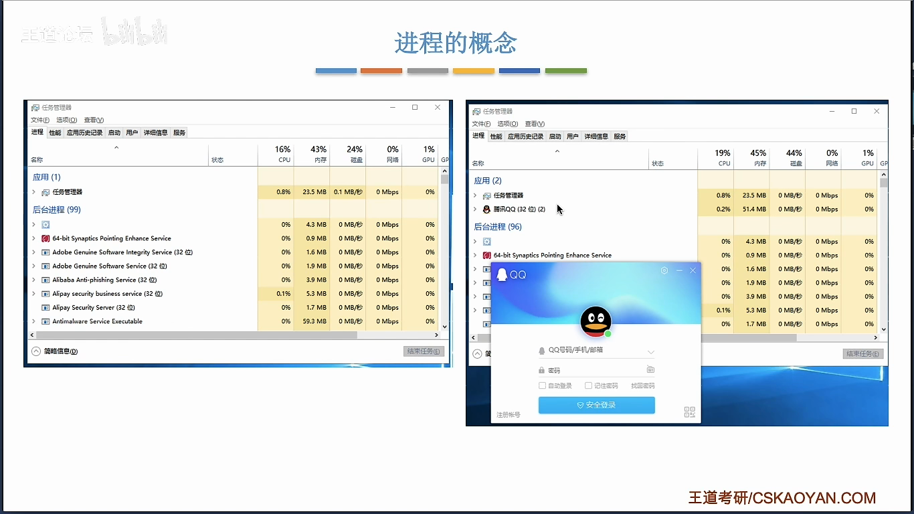
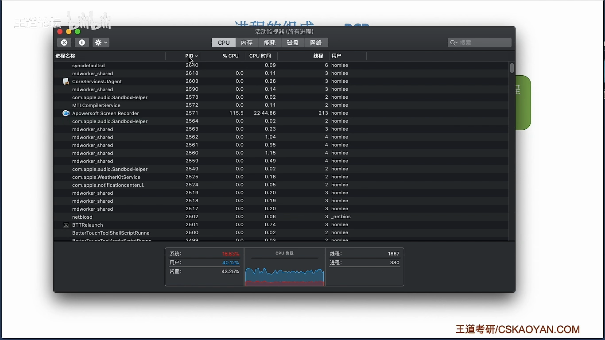
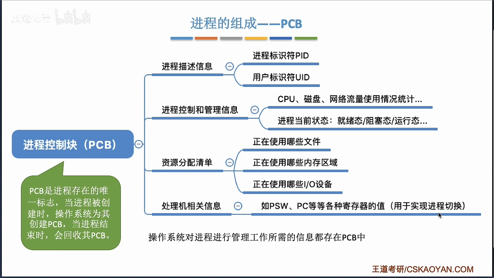
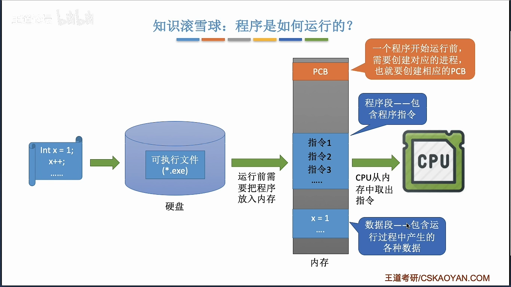
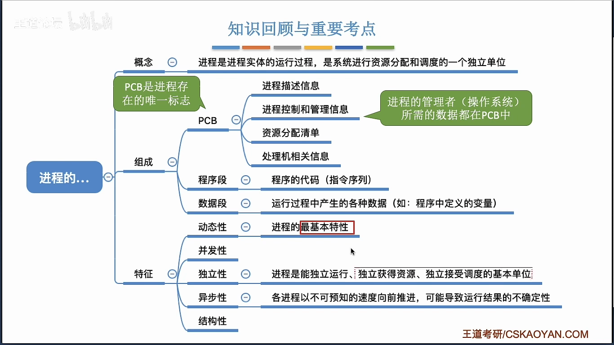

# 进程的概念、组成、特征

> 📖 笔记整理自：【王道计算机考研 操作系统】2.1.1 + 2.1.2
> 🔴 **重要度：核心考点**（进入第二章进程管理，PCB 是重中之重）

---

## 本节主题

从这一节开始正式进入**第二章：进程管理**。本节回答三个问题：进程是什么？进程由什么组成？进程有哪些特征？核心中的核心是 **PCB（进程控制块）**——它是进程存在的唯一标志。

---

## 核心知识点

### 1. 程序 vs 进程

> 🖼️ **图解说明**：老师打开 Windows 任务管理器，展示了打开 QQ 后出现进程条目，再多开两个 QQ（同时挂三个号），任务管理器中出现了三个 QQ 进程——**同一个程序，多次执行，对应多个进程**。



| | 程序 | 进程 |
|---|------|------|
| **本质** | 静态的 | 动态的 |
| **存放** | 磁盘上的可执行文件（如 `qq.exe`） | 程序的**一次执行过程** |
| **数量关系** | 一个程序 → 可以对应多个进程 | 每个进程有唯一的 PID |

> 💡 **关键例子**：老师用 QQ 举例——
> - QQ 程序只有一个（`qq.exe` 存在磁盘里）
> - 但同时挂 3 个 QQ 号 → 任务管理器里出现 3 个 QQ 进程
> - 这 3 个进程的**程序段相同**（都执行 qq.exe 的指令），但 **PCB 和数据段不同**（不同的账号数据、不同的 PID）

### 2. PID——进程的身份证号

操作系统给每个进程分配一个**唯一的、不重复的 ID**，叫做 **PID（Process ID）**。

> 💡 **关键例子**：老师在 Mac 的活动监视器上现场演示——
> - 打开一个叫 Toro 的应用 → PID = 2641
> - 退出后再打开 → PID = 2642
> - **每次新建进程，PID 递增**，绝不复用（在很多 OS 中就是简单的 +1 策略）

> 🖼️ **图解说明**：老师的 Mac 活动监视器界面——每个进程都有唯一的 PID，还能看到 CPU 时间、线程数、用户等信息。底部显示当前共 380 个进程、1667 个线程。



### 3. PCB（进程控制块）——进程存在的唯一标志

操作系统需要记录每个进程的大量信息（PID、内存使用、磁盘访问、网络流量…），这些信息统一放在一个数据结构里——**PCB（Process Control Block，进程控制块）**。

> 🖼️ **图解说明**：PCB 内部信息的四大分类，树状结构一目了然。



PCB 里存的四类信息：

| 类别 | 包含内容 | 用途 |
|------|---------|------|
| **进程描述信息** | PID、UID（用户ID） | 区分各个进程 |
| **进程控制和管理信息** | 进程当前状态（就绪/运行/阻塞）、CPU/磁盘/网络使用统计 | 进程调度和控制 |
| **资源分配清单** | 正在使用的文件、内存区域、I/O 设备 | 资源管理 |
| **处理机相关信息** | PSW、PC 等各种寄存器的值 | 实现**进程切换**（后面会讲） |

**关键结论**：
- **PCB 是进程存在的唯一标志**
- 创建进程 = 创建 PCB；销毁进程 = 回收 PCB
- 操作系统管理进程所需的一切信息都在 PCB 里

> 💡 **关键例子**：老师找了 Linux 内核源码——
> - 在 `sched.h` 文件中定义了一个叫 `task_struct` 的数据结构，这就是 Linux 的 PCB
> - 里面有 `state`（进程状态）、`files`（打开的文件）、`io_context`（I/O 信息）等字段
> - **光这个结构体的定义就写了 1900 多行代码**——所以我们不需要记所有字段，只需要理解 PCB 的作用

### 4. 进程的组成：PCB + 程序段 + 数据段

> 🖼️ **图解说明**：一个程序从源码到执行的完整过程——源码 → 编译为可执行文件（*.exe）→ 运行前从硬盘读入内存 → 内存中形成三部分：PCB（给 OS 用）、程序段（指令序列）、数据段（变量等运行数据）→ CPU 从内存取指令执行。



```
         ┌──────────────┐
         │     PCB      │  ← 给操作系统用（PID、状态、资源清单…）
         ├──────────────┤
         │    程序段    │  ← 程序的指令序列（代码）
         │    指令1     │
         │    指令2     │
         │    指令3     │
         │     ...      │
         ├──────────────┤
         │    数据段    │  ← 运行过程中的数据（变量值等）
         │    x = 1     │
         │     ...      │
         └──────────────┘
               内存
```

**谁用什么**：
- **PCB** → 给**操作系统**用的（管理进程）
- **程序段 + 数据段** → 给**进程自己**用的（运行逻辑 + 运行数据）

> 💡 **关键例子**：三个 QQ 进程——
> - **程序段**：三个都一样（都是 qq.exe 的指令）
> - **数据段**：三个不一样（三个不同 QQ 号的数据）
> - **PCB**：三个不一样（不同的 PID、不同的资源使用情况）

### 5. 进程实体 vs 进程

| | 进程实体（进程映像） | 进程 |
|---|---|---|
| **性质** | 静态的 | 动态的 |
| **含义** | 进程在某一时刻的快照/照片 | 进程实体的运行过程 |
| **组成** | PCB + 程序段 + 数据段 | — |

> 除非题目特别考察两者区别，否则可以把"进程"等同于"进程实体"。

**进程的正式定义**：进程是进程实体的运行过程，是系统进行**资源分配**和**调度**的独立单位。

---

### 6. 进程的五大特征

> 🖼️ **图解说明**：本节知识的总结思维导图——概念、组成（PCB/程序段/数据段）、特征（动态性/并发性/独立性/异步性/结构性）一图总览。注意"动态性"旁边红框标注了"最基本特性"。



| 特征 | 含义 | 备注 |
|------|------|------|
| **动态性** ⭐ | 进程是动态产生、变化、消亡的 | **最基本的特性** |
| **并发性** | 多个进程可以并发执行 | |
| **独立性** | 进程能独立运行、独立获得资源、独立接受调度 | ⚠️ 引入线程后，调度的基本单位变为线程 |
| **异步性** | 各进程以不可预知的速度向前推进 | 可能导致执行结果不确定 → 需要进程同步 |
| **结构性** | 每个进程都有 PCB + 程序段 + 数据段 | |

---

## 常见坑

1. **PCB 是进程存在的唯一标志**，不是 PID——PID 只是 PCB 里的一个字段
2. **动态性**是进程最基本的特性（不是并发性）
3. 进程是**资源分配**的基本单位，但引入线程后，进程**不再是调度的基本单位**（线程才是）
4. 同一程序多次执行：**程序段相同，PCB 和数据段不同**

---

## 一句话结论

**进程 = PCB + 程序段 + 数据段**。PCB 是操作系统管进程的"档案袋"（进程的身份证、资源清单、状态记录全在里面），是进程存在的唯一标志。记住：程序是死的（磁盘上的文件），进程是活的（程序跑起来的那个过程）。

---

*Last Updated: 2026-03-07*
