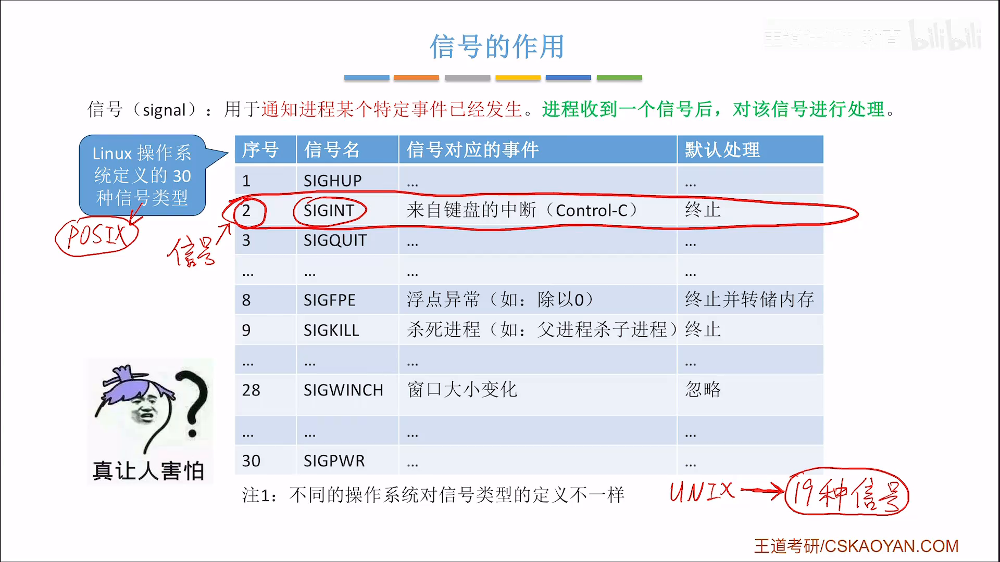
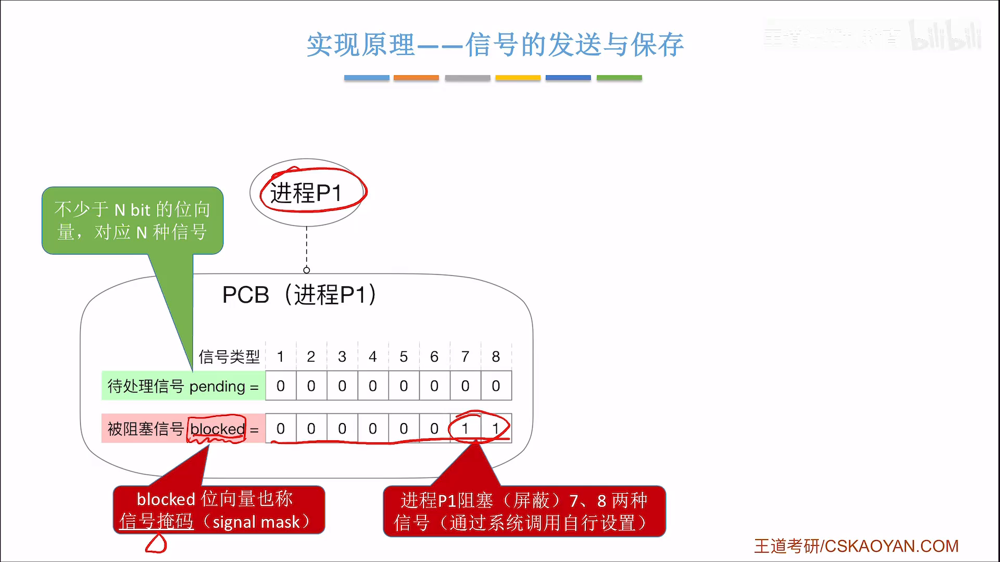
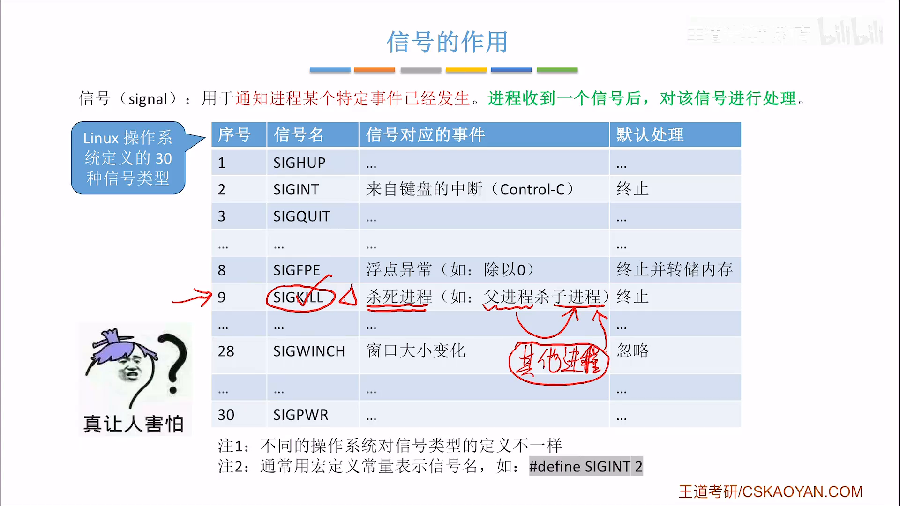
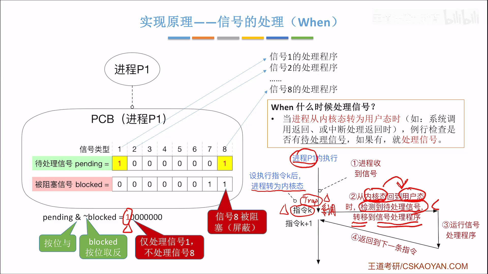
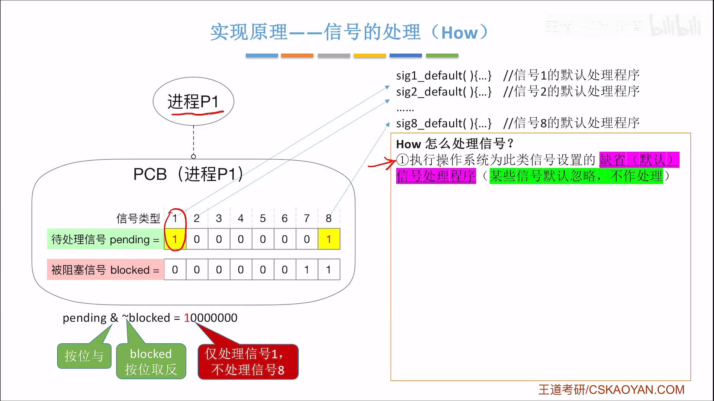
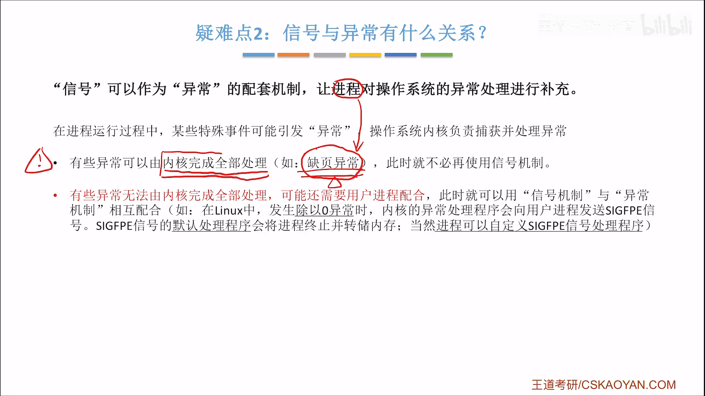
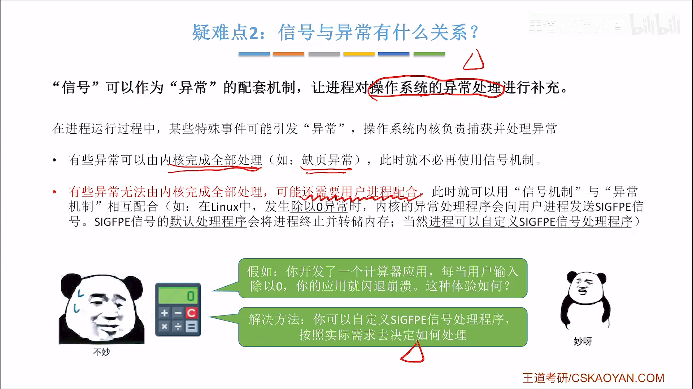

# 信号（Signal）

> 📖 笔记整理自：【王道计算机考研 操作系统】2.1.5.2 信号
> 🔴 **重要度：核心考点**（2025届新增考点，掌握原理及特点）

---

## 本节主题

本节是 2025 届考研大纲**新增考点**。信号（Signal）是进程间通信的一种机制，用于通知进程某个特定事件已发生。本节依次回答四个问题：信号是什么、如何发送与保存、何时处理、怎么处理，最后讨论信号与异常的关系。

> ⭐ **易混淆**：信号（Signal，英文 `signal`）和信号量（Semaphore，英文 `semaphore`）是**完全不同**的两个东西。信号量用于进程同步互斥，信号用于进程间通信。

---

## 一、信号的作用

信号可以**通知某个进程，某个特定事件已经发生**，进程收到信号后需要对其进行处理。

Linux 系统定义了 30 种符合 POSIX 标准的信号（实际更多），每种信号有唯一的**序号**和**信号名**（本质是宏定义常量）。



> 🖼️ **图解说明**：表格中每一行对应一种信号，列出了序号（1～30+）、信号名（如 `SIGINT`、`SIGFPE`）以及默认处理动作（终止进程、忽略、转储内存等）。不同操作系统的信号定义不同，早期 UNIX 只有 19 种。

> 💡 **关键例子**：
> - 在终端运行程序时按下 **Ctrl+C**，内核会向该进程发送 `SIGINT`（序号 2），默认处理是**终止进程**。
> - 程序发生**除以零**的 bug，内核向进程发送 `SIGFPE`（Floating Point Exception，序号 8），默认处理是**终止进程并转储内存**（core dump）——这就是程序崩溃后硬盘里留下 crash 信息的原因。

---

## 二、信号的发送与保存

### PCB 中的两个位向量

每个进程的 PCB 中有两个 N 位的位向量：

| 位向量 | 含义 |
|---|---|
| **pending**（待处理） | 记录已收到但尚未处理的信号，某位为 1 表示收到了该类信号 |
| **blocked**（被阻塞/信号掩码） | 记录被进程屏蔽的信号，某位为 1 表示该类信号被阻塞，暂不处理 |

进程可以通过**系统调用**自行设置 blocked，决定屏蔽哪些信号。



> 🖼️ **图解说明**：以 8 种信号的系统为例，pending 和 blocked 各用 8 个比特表示。图中进程 P1 的 blocked 末尾两位为 1，表示屏蔽了 7 号和 8 号信号。

### kill 函数发送信号

最灵活、最常用的发送信号的系统调用是 **kill 函数**：

```c
kill(pid, signum)
// pid: 接收进程的 PID
// signum: 信号序号
```

用户进程之间、内核进程向用户进程，都可以调用 kill 函数发送信号。



> 🖼️ **图解说明**：进程 P2 向 P1（PID=2666）发送 1 号信号，内核进程也向 P1 发送 1 号信号，进程 P3 向 P1 发送 8 号信号。最终 P1 的 pending 向量中第 1 位和第 8 位变为 1。

> ⭐ **重要特性——重复信号直接丢弃**：
> 因为 pending 每类信号只有**一个比特**记录，P2 和内核进程都发了 1 号信号，但 P1 只记录一次，第二个重复的 1 号信号被**直接丢弃**，且无法区分来自哪个进程。

> ⭐ **权限限制**：用户进程之间允许发送的信号类型有限制。例如 `SIGKILL`（9 号，用于杀死进程）只有父进程才能发给子进程，普通用户进程不能随意向其他进程发送，否则系统会混乱。操作系统内核拥有最高权限，发信号无限制。

---

## 三、何时处理信号（When）

**每次进程从内核态转为用户态时**，都会例行检查是否有待处理的信号。

常见的从内核态转回用户态的时机：
- 系统调用返回时
- 中断处理完成返回时

### 检测逻辑（位运算）

```
pending  AND  (NOT blocked)  →  需要处理的信号集合
```



> 🖼️ **图解说明**：将 blocked 按位取反，再与 pending 逐位做与运算。图中 P1 的 pending 第 1 位和第 8 位为 1，blocked 第 7、8 位为 1；取反后得到第 1～6 位为 1、第 7、8 位为 0；逐位与后，只有第 1 位为 1——说明此时只需处理 1 号信号，8 号信号虽然收到了但被阻塞，暂时不处理。

---

## 四、怎么处理信号（How）

### 两种处理程序

1. **默认处理程序**：操作系统为每种信号配置默认动作，例如：
   - 终止进程（`SIGINT`、`SIGFPE` 等）
   - 忽略（`SIGWINCH` 窗口大小变化，默认空函数）
   - 终止并转储内存（`SIGFPE`）

2. **用户自定义处理程序**：进程可通过系统调用为某些信号注册自己的处理函数，**覆盖**默认处理逻辑。



> 🖼️ **图解说明**：进程 P1 执行指令序列，在指令 K（如 trap 指令引发系统调用）处进入内核态，系统调用返回转回用户态时，检测到 1 号信号待处理，跳转执行信号 1 的处理程序，处理完后返回指令 K+1 继续执行。

> 💡 **生动例子——窗口大小变化**：
> - `SIGWINCH` 的默认处理是**忽略**（空函数）。
> - 但实际应用（如终端编辑器、浏览器）在窗口缩放时需要**动态调整 UI 布局**。
> - 做法：自定义 `SIGWINCH` 的处理程序，收到信号时重新计算布局并刷新界面。
> - 这说明自定义信号处理程序在实际开发中非常有用。

### 信号处理的细节

| 细节 | 说明 |
|---|---|
| 处理完毕后的行为 | 通常返回进程的**下一条指令**继续执行（除非处理程序阻塞或终止了进程） |
| 处理后重置 | 处理完信号后，pending 中该信号的对应位**重置为 0** |
| 重复信号 | 同类信号重复到达，后续重复信号**直接丢弃** |
| 多信号并存 | 同时有多个不同类型信号待处理，通常**优先处理序号更小**的信号 |

---

## 五、各进程的信号处理相互独立



> 🖼️ **图解说明**：进程 P1 自定义了 2 号信号的处理程序，进程 P2 自定义了 4 号信号的处理程序，两者各有自己的 pending 和 blocked 向量，互不影响。P1 阻塞了 7、8 号信号，P2 阻塞了 1、2、3 号信号。

- 每个进程自定义的信号处理程序**只作用于自身**，不影响其他进程。
- 每个进程有自己独立的 pending 和 blocked 向量。
- 没有自定义时，执行操作系统配置的默认处理程序。

---

## 六、信号与异常的关系

**结论：信号可以作为异常处理的配套机制，让进程对操作系统的异常处理进行个性化补充。**



> 🖼️ **图解说明**：图示展示了异常发生→内核捕获→发送信号→进程处理的完整链路。缺页异常可由内核完全处理；而除零异常内核处理后还需通知用户进程，用信号机制完成这一"通知"。

- 有些异常（如缺页异常）可由内核**完全处理**，不需要进程参与。
- 有些异常（如除零）处理后需要**通知用户进程**，这就用信号完成。

> 💡 **关键例子——计算器应用**：
> - 舍友使用你写的计算器，输入了「1 ÷ 0」。
> - 内核捕获除零异常，向计算器进程发送 `SIGFPE`。
> - **默认处理**：进程直接崩溃（闪退），用户体验极差。
> - **自定义处理**：捕获 `SIGFPE`，在界面上打印「输入有误，请重新输入」，程序正常继续运行。
> - 这就是自定义信号处理程序在实际开发中的意义。

---

## 考点速记

> ⭐ **有些信号既不允许被阻塞，也不允许被用户自定义处理函数**，典型例子：Linux 的 `SIGKILL`（9）和 `SIGSTOP`（19/17）。这两个信号是操作系统保留的"最终手段"，任何进程都无法屏蔽或覆盖。

| 考点 | 要点 |
|---|---|
| 信号 vs 信号量 | 完全不同：信号用于通信，信号量用于同步互斥 |
| 发送信号 | `kill(pid, signum)`，指定 PID 和信号序号 |
| 保存方式 | PCB 中 N 位 pending 位向量，每类信号占 1 位 |
| 处理时机 | 进程从内核态转为用户态时检查 |
| 检测方式 | `pending AND (NOT blocked)` |
| 重复信号 | 同类重复信号直接丢弃（位向量限制） |
| 多信号并存 | 优先处理序号更小的信号 |
| 不可阻塞/不可自定义 | `SIGKILL`、`SIGSTOP` |

---

> **黄金总结**：信号是内核通知进程"某事已发生"的异步机制，以 PCB 中的位向量保存、在内核态返回用户态时检测，进程可自定义处理逻辑覆盖默认行为，从而实现灵活的进程间通信和异常补充处理。
