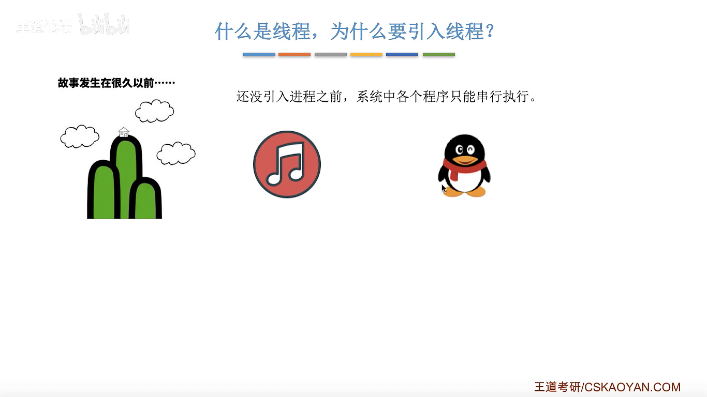
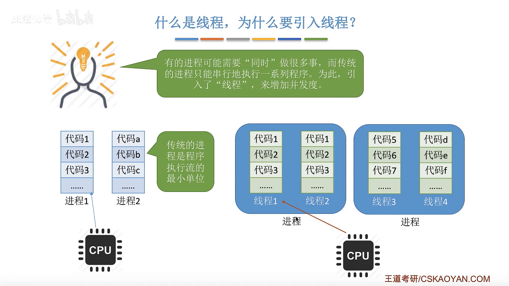
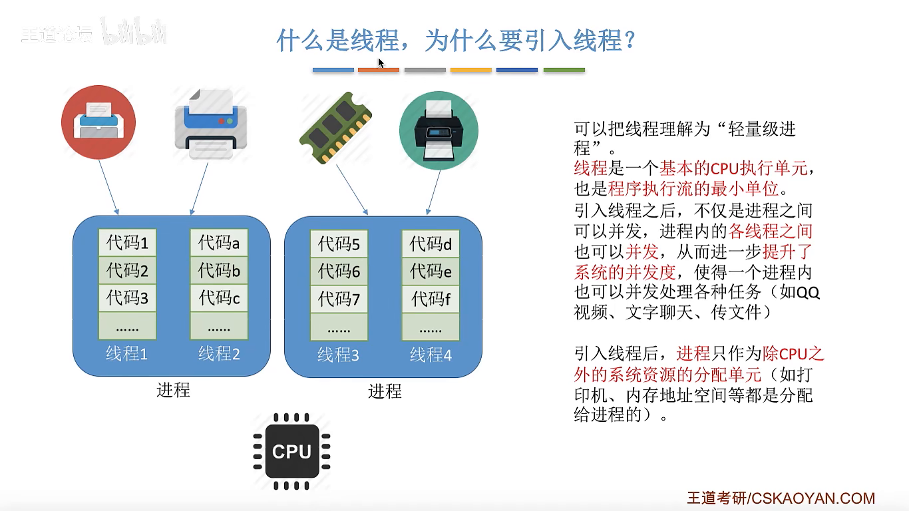
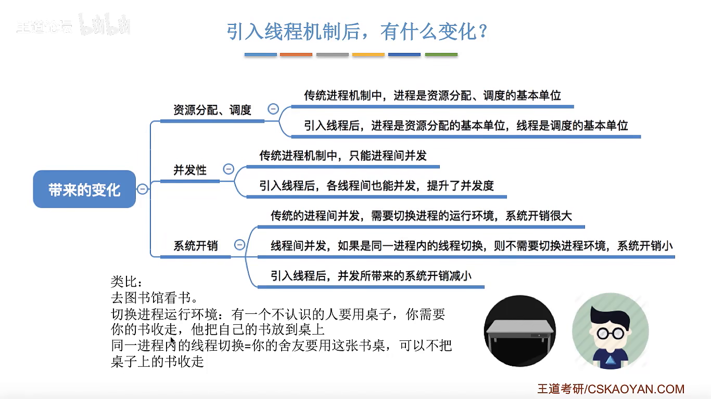
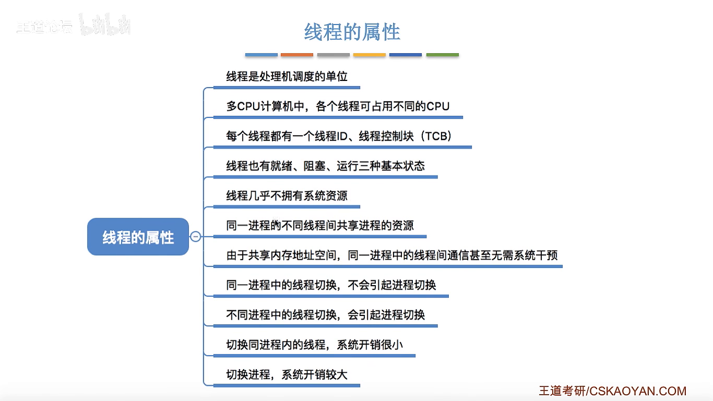

# 线程的概念与特点

> 📖 笔记整理自：【王道计算机考研 操作系统】2.1.6.1 线程的概念与特点
> 🟡 **重要度：核心考点**（线程是进程管理的重要延伸，必须掌握）

---

## 本节主题

为什么要引入线程？引入线程后系统发生了哪些变化？线程有哪些重要属性？本节从一个 QQ 的例子出发，逐步回答这三个问题。

---

## 一、为什么要引入线程？

### 进程机制的局限

传统进程机制中，**进程是执行流的最小单位**，每个进程只能串行地执行一段程序代码。

> 🖼️ **图解说明**：CPU 轮流为各进程服务，每个进程对应一份顺序执行的代码流。进程之间可以并发，但进程内部只能串行。

> 💡 **关键例子——QQ 的困境**：
> - QQ 需要同时做三件事：**视频聊天、文字聊天、传送文件**。
> - 在传统进程机制下，进程内部只能串行执行，这三件事无法在用户感知层面"同时发生"。
> - 这就是引入线程的根本动机：让一个进程内部也能并发地处理多件事。

### 引入线程后的变化

引入线程机制后，**CPU 的调度单位从进程变成了线程**。

> 🖼️ **图解说明**：一个进程内部被拆分为多个线程，CPU 轮流为各线程服务。QQ 进程中，视频聊天和文件传输分属两个线程，两者可以并发执行，用户感知上"同时发生"。

- **线程**是程序执行流的最小单位，也是基本的 CPU 执行单元。
- 同一进程内的多个线程可以并发执行，进一步提升系统并发度。

---

## 二、引入线程前后的对比

> 🖼️ **图解说明**：表格对比了传统进程机制与引入线程后的三个维度变化：资源分配单位、调度单位、并发粒度。

| 对比维度 | 传统进程机制 | 引入线程后 |
|---|---|---|
| **资源分配单位** | 进程（既分配资源又调度） | 进程（只负责资源分配） |
| **CPU 调度单位** | 进程 | **线程** |
| **并发粒度** | 进程间并发 | 进程间 + 进程内线程间均可并发 |
| **切换开销** | 大（需切换进程运行环境） | 同进程内线程切换开销小 |

> ⭐ **重点**：引入线程后，**进程不再是 CPU 调度的基本单位**，只作为除 CPU 之外的系统资源的分配单元（内存、I/O 设备等仍分配给进程）。

---

## 三、线程切换开销为何更小？

> 🖼️ **图解说明**：用图书馆桌子的场景类比进程/线程切换，直观展示运行环境切换带来的代价差异。

> 🌰 **生动比喻——图书馆抢桌子**：
> - **进程切换**：你在图书馆占了一张桌子用自己的书。一个陌生人要用这张桌子，你必须把自己的书全部收走，他再把自己的书摆上来。这个"搬书"的过程就是**切换进程运行环境**，代价较大。
> - **同进程内线程切换**：要用桌子的人是你舍友（同属一个进程），因为你们共享同一套书（共享进程资源），书不需要动，直接换人坐即可。开销极小。

**核心原因**：同一进程内的线程**共享进程的内存地址空间和系统资源**，切换时无需切换这些运行环境。

---

## 四、线程的重要属性

> 🖼️ **图解说明**：列出线程的核心属性：线程 ID、线程控制块（TCB）、三种基本状态、资源共享方式、切换开销对比。

| 属性 | 说明 |
|---|---|
| **调度单位** | 线程是处理机调度的基本单位 |
| **多核利用** | 多核 CPU 中，不同线程可分配到不同核心并行执行 |
| **线程 ID + TCB** | 每个线程有唯一 ID 和线程控制块（类似进程的 PCB） |
| **基本状态** | 就绪、阻塞、运行（与进程相同） |
| **资源** | 线程几乎不拥有系统资源，资源归进程所有 |
| **资源共享** | 同进程内的线程共享该进程的内存地址空间、I/O 设备等资源 |
| **线程间通信** | 同进程内线程可直接通过共享内存通信，**无需操作系统干预** |

### 线程切换与进程切换的关系

| 切换类型 | 是否引起进程切换 | 开销 |
|---|---|---|
| 同进程内线程切换 | ❌ 不引起 | 小 |
| 不同进程间线程切换 | ✅ 引起进程切换 | 大（需切换运行环境） |

---

## 考点速记

| 考点 | 要点 |
|---|---|
| 线程的本质 | 轻量级进程，程序执行流的最小单位，基本 CPU 执行单元 |
| 引入线程的目的 | 提高系统并发度，使一个进程内也能并发处理多任务 |
| 进程 vs 线程职责 | 进程负责资源分配；线程负责 CPU 调度 |
| 线程间共享什么 | 同进程内线程共享内存地址空间、I/O 设备等进程资源 |
| 线程间通信 | 可通过共享内存直接通信，无需 OS 干预 |
| 线程几乎不拥有资源 | 线程自己只有线程 ID、TCB、栈、寄存器等少量私有数据 |

---

> **黄金总结**：线程是在进程内部引入的"更细粒度的执行单元"，使得一个进程可以同时并发处理多件事，且同进程内的线程切换开销远小于进程切换，从而在提升并发度的同时显著降低系统开销。
