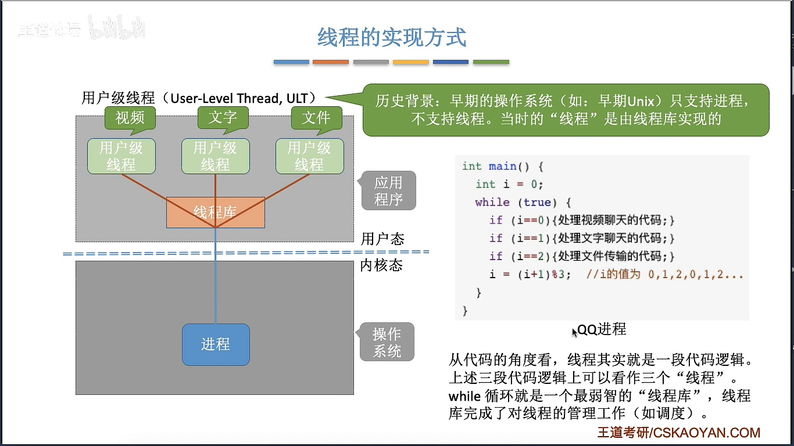
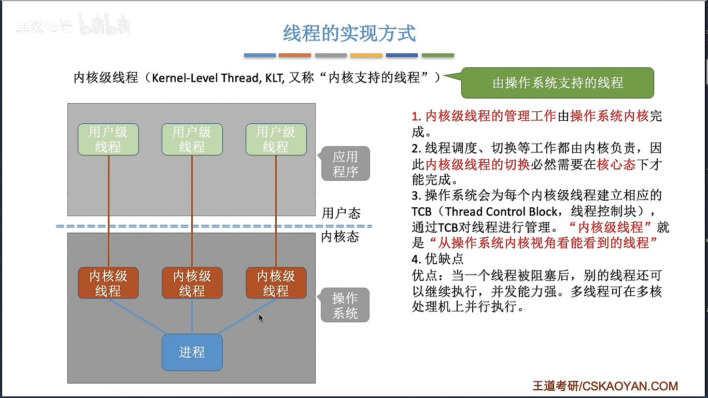
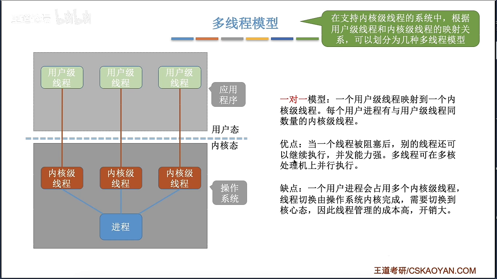
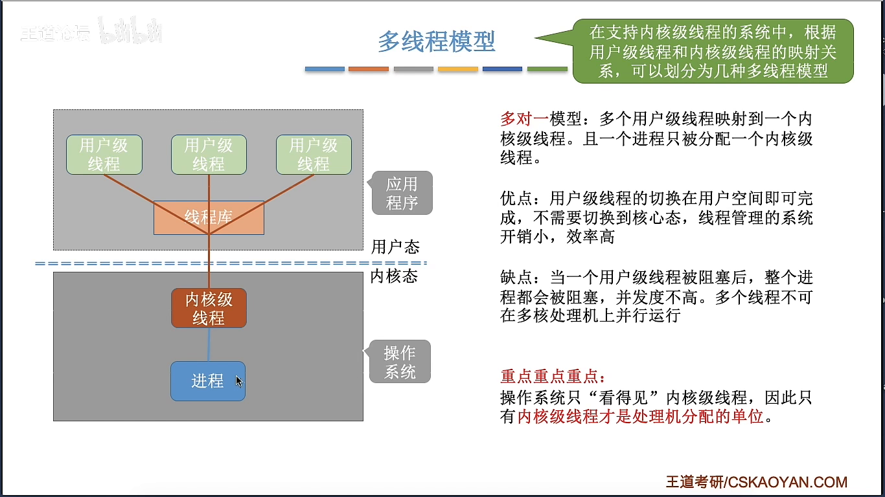
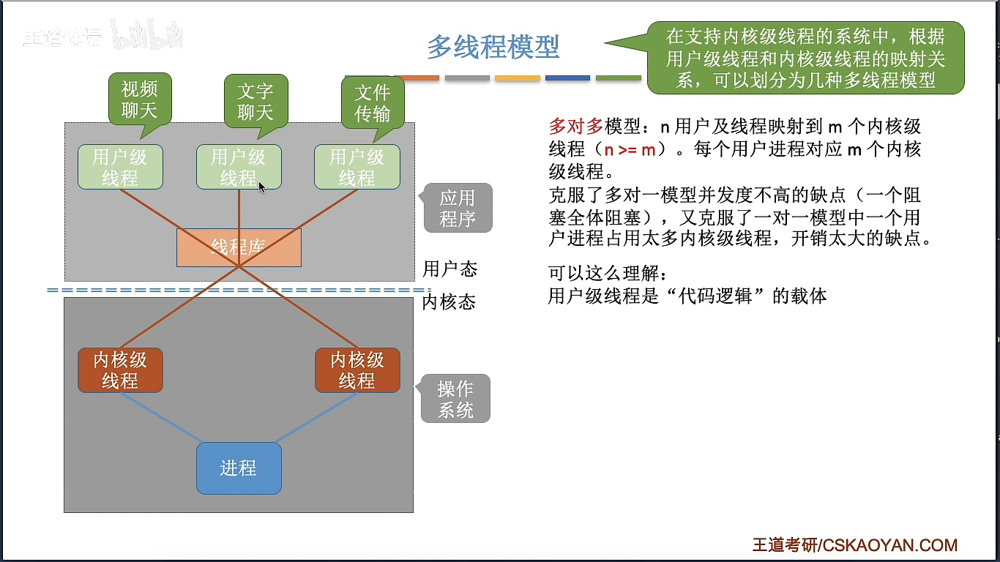

# 线程的实现方式和多线程模型

> 📖 笔记整理自：【王道计算机考研 操作系统】2.1.6.2 线程的实现方式和多线程模型
> 🟡 **重要度：核心考点**（重点考察阻塞问题和模型优缺点对比）

---

## 本节主题

线程有两种实现方式：**用户级线程**和**内核级线程**。根据二者的映射关系，衍生出三种多线程模型：一对一、多对一、多对多。本节逐一分析各自的原理、优缺点。

---

## 一、用户级线程（User-Level Thread）

### 原理

早期操作系统只支持进程，不支持线程。程序员通过**线程库**在用户态自行实现多线程——操作系统视角依然只看到进程，线程是程序员自己模拟出来的。


> 🖼️ **图解说明**：QQ 进程用一个 while 循环 + i 变量轮流执行视频聊天（i=0）、文字聊天（i=1）、文件传输（i=2）三段逻辑。这个 while 循环就是最简陋的"线程库"，负责三个用户级线程的调度。

> 💡 **关键例子——最弱智的线程库**：
> ```
> while (true) {
>     if (i == 0) 处理视频聊天();
>     if (i == 1) 处理文字聊天();
>     if (i == 2) 处理文件传输();
>     i = (i + 1) % 3;
> }
> ```
> 这段伪代码用 while 循环 + if 判断，就实现了三个"线程"交替运行——这就是用户级线程的本质。真实的线程库（如 pthread）比这复杂得多，但原理相同。

### 三个核心问题

| 问题 | 答案 |
|---|---|
| 谁来管理线程？ | **应用程序通过线程库**自行管理，操作系统不参与 |
| 切换是否需要变态？ | **不需要**，线程切换在用户态完成，无需切换到内核态 |
| OS 能感知到线程？ | **不能**，操作系统只看到进程，感知不到用户级线程 |

### 优缺点



> 🖼️ **图解说明**：左侧展示用户级线程管理不涉及内核态切换（开销小），右侧展示一个线程阻塞导致整个进程卡死的问题。

| | 说明 |
|---|---|
| ✅ **优点** | 线程管理（创建、切换、销毁）无需切换到内核态，**开销小、效率高** |
| ❌ **缺点 1** | 某个线程阻塞（如等待摄像头资源），while 循环无法继续，**整个进程都被阻塞**，其他线程也跟着停 |
| ❌ **缺点 2** | OS 以进程为调度单位，即使多核 CPU，该进程也只能用**一个核心**，线程无法真正并行 |

---

## 二、内核级线程（Kernel-Level Thread）

### 原理

现代操作系统（Windows、Linux 等）直接在内核层面支持线程，操作系统能看到并管理每一个线程。

### 三个核心问题

| 问题 | 答案 |
|---|---|
| 谁来管理线程？ | **操作系统**负责管理 |
| 切换是否需要变态？ | **需要**，线程切换须从用户态切换到内核态 |
| OS 能感知到线程？ | **能**，内核级线程对 OS 完全可见 |

### 优缺点



> 🖼️ **图解说明**：三个内核级线程分属不同核心并行运行，其中一个阻塞，另外两个不受影响继续执行。

| | 说明 |
|---|---|
| ✅ **优点 1** | 内核级线程是处理机分配基本单位，多核 CPU 下可**真正并行**执行 |
| ✅ **优点 2** | 某线程阻塞，其他线程**不受影响**，并发能力强 |
| ❌ **缺点** | 线程切换需要 CPU 在用户态↔内核态之间切换，**管理开销大** |

---

## 三、三种多线程模型

在支持内核级线程的系统中，再引入线程库，就可以将用户级线程映射到内核级线程，从而产生三种模型。

### 1. 一对一模型

每个用户级线程对应一个内核级线程。



> 🖼️ **图解说明**：三个用户级线程分别映射到三个内核级线程，一一对应，每个线程都能独立获得 CPU 时间片。

| | 说明 |
|---|---|
| ✅ **优点** | 并发能力强，一个阻塞不影响其他；可在多核上**并行**执行 |
| ❌ **缺点** | 用户级线程数 = 内核级线程数，内核级线程多，**管理开销大** |

---

### 2. 多对一模型

多个用户级线程映射到**一个**内核级线程（退化为纯用户级线程方案）。



> 🖼️ **图解说明**：三个用户级线程共用同一个内核级线程，线程调度由线程库在用户态完成，OS 只看到一个线程。

| | 说明 |
|---|---|
| ✅ **优点** | 线程管理在用户态完成，**开销小、效率高** |
| ❌ **缺点 1** | 一个用户级线程阻塞，**整个进程都阻塞** |
| ❌ **缺点 2** | 进程只有一个内核级线程，只能分到**一个 CPU 核心**，无法并行 |

> ⭐ 考试中提到多对一模型，默认一个进程只被分配了一个内核级线程。

---

### 3. 多对多模型

n 个用户级线程映射到 m 个内核级线程（n ≥ m），综合两者优点。



> 🖼️ **图解说明**：三个用户级线程映射到两个内核级线程。左侧内核级线程专门跑视频聊天（CPU 密集），右侧内核级线程并发跑文字聊天和文件传输。某个内核级线程阻塞，另一个可继续运行。

| | 说明 |
|---|---|
| ✅ **优点 1** | 有多个内核级线程，一个阻塞不影响全部，**并发度高** |
| ✅ **优点 2** | 内核级线程数 ≤ 用户级线程数，**管理开销比一对一小** |
| ✅ **优点 3** | 可灵活调配：CPU 密集的任务独占一个内核级线程，其余任务共享另一个 |

> 💡 **关键理解——用户级 vs 内核级的本质区别**：
> - **用户级线程** = 代码逻辑的载体（承载"做什么"）
> - **内核级线程** = 运行机会的载体（决定"能不能跑"）
> - OS 分配 CPU 时以内核级线程为单位，代码逻辑只有搭上内核级线程才能被执行。

---

## 四、三种模型对比总结

| 模型 | 映射关系 | 并发能力 | 管理开销 | 阻塞影响 | 能否并行 |
|---|---|---|---|---|---|
| **一对一** | 1用户:1内核 | 强 | 大 | 只阻塞当前线程 | ✅ 可并行 |
| **多对一** | 多用户:1内核 | 弱 | 小 | 一个阻塞全阻塞 | ❌ 不可并行 |
| **多对多** | n用户:m内核 (n≥m) | 较强 | 较小 | 部分阻塞 | ✅ 可并行 |

---

## 考点速记

> ⭐ **高频考点——阻塞问题**：
> - **用户级线程 / 多对一模型**：一个线程阻塞 → 整个进程阻塞
> - **内核级线程 / 一对一模型**：一个线程阻塞 → 其他线程不受影响
> - **多对多模型**：只有所有内核级线程都阻塞，进程才进入阻塞状态

> ⭐ **切换开销**：
> - 用户级线程切换：**无需变态**，开销小
> - 内核级线程切换：**需要变态**（用户态→内核态→用户态），开销大

---

> **黄金总结**：用户级线程开销小但并发弱，内核级线程并发强但开销大，多对多模型综合二者优点——用内核级线程数量少于用户级线程的方式，在保持较高并发度的同时控制管理开销。
