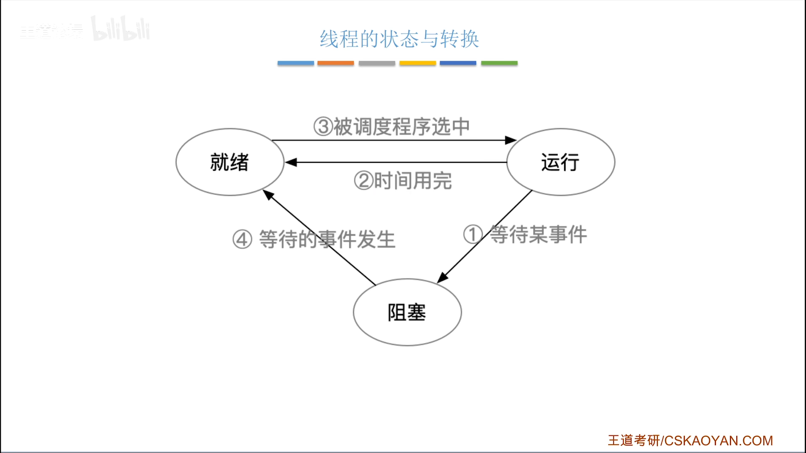
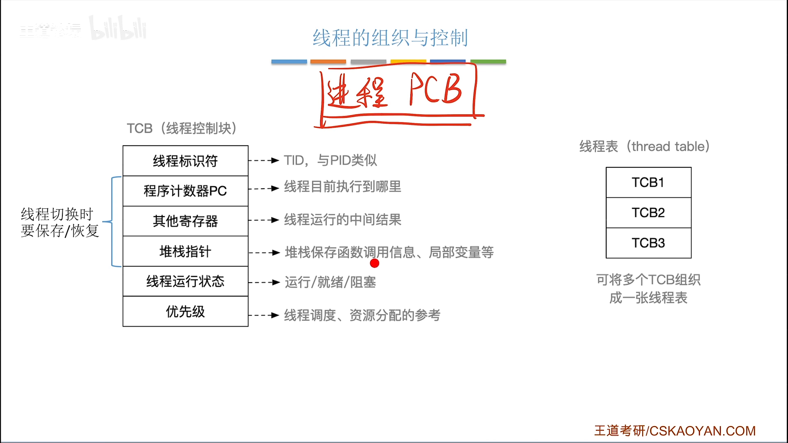
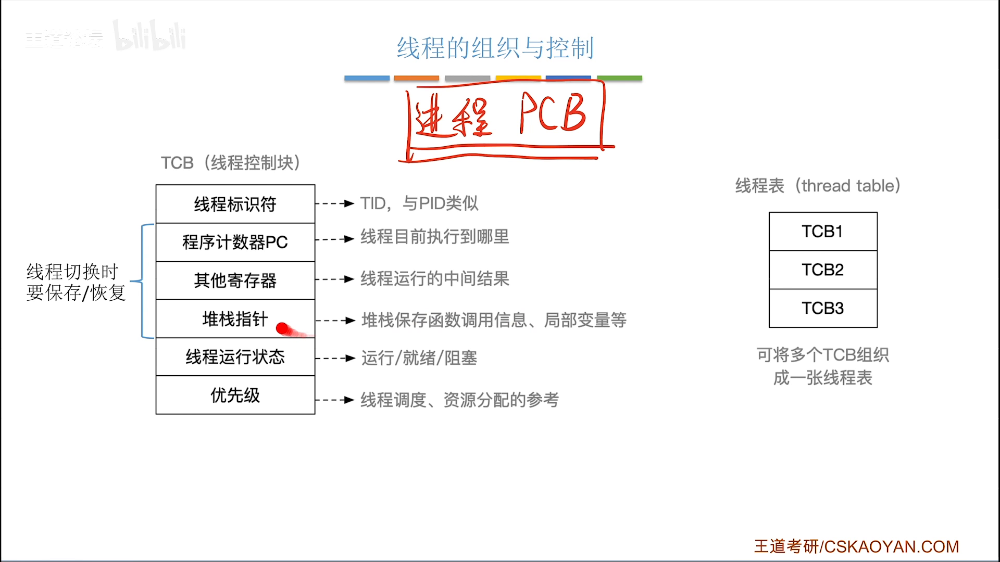

# 线程的状态与转换、组织与控制

> 📖 笔记整理自：【王道计算机考研 操作系统】2.1.6.3 线程的状态与转换
> 🟢 **重要度：快速了解**（与进程高度类似，掌握差异点即可）

---

## 本节主题

线程的状态与转换、组织与控制与进程几乎一模一样，本节重点掌握 TCB 的结构内容，以及线程切换时需要保存/恢复哪些运行现场信息。

---

## 一、线程的状态与转换

线程有三种基本状态，转换规则与进程完全一致：

> 🖼️ **图解说明**：三个状态形成循环：就绪态 → 运行态 → 阻塞态 → 就绪态。调度程序选中就绪线程使其上处理机；时间片用完则退回就绪态；等待 I/O 等事件则进入阻塞态；事件发生后回到就绪态。

| 转换 | 触发条件 |
|---|---|
| 就绪 → 运行 | 调度程序选中该线程，分配处理机 |
| 运行 → 就绪 | 时间片用完，被剥夺处理机 |
| 运行 → 阻塞 | 等待某事件（如 I/O 完成） |
| 阻塞 → 就绪 | 等待的事件已发生 |

> ⭐ 线程的状态转换与进程**完全一致**，考试中掌握三状态模型即可。

---

## 二、线程控制块（TCB）

操作系统管理线程，需要为每个线程建立对应的数据结构——**TCB（Thread Control Block，线程控制块）**，类比进程的 PCB。

> 🖼️ **图解说明**：TCB 中包含线程 ID、程序计数器、通用寄存器、堆栈指针、运行状态、优先级等字段，结构与 PCB 类似但更轻量。

### TCB 包含的主要内容

| 字段 | 作用 |
|---|---|
| **线程 ID** | 线程的唯一标识（类比进程的 PID） |
| **程序计数器 PC** | 记录线程当前执行到哪条指令 |
| **通用寄存器** | 保存代码运行中间结果（切换时需保存/恢复） |
| **堆栈指针 SP** | 指向该线程堆栈在内存中的位置 |
| **运行状态** | 就绪 / 运行 / 阻塞（及阻塞原因） |
| **优先级** | 调度和资源分配时的参考依据 |

### 线程切换时需保存/恢复的运行现场

> 💡 **关键例子——堆栈的作用**：
> 函数 A 调用了 B，B 调用了 C——堆栈记录了每层函数调用的**返回地址**（B 执行完回到 A 的哪行）以及每层函数的**局部变量**。堆栈本身可能很大，所以 TCB 只保存**堆栈指针（SP）**，通过指针找到堆栈在内存中的位置即可。

线程下处理机时，需将以下信息保存到 TCB：
1. **程序计数器 PC**（执行到哪了）
2. **各通用寄存器的值**（中间运算结果）
3. **堆栈指针 SP**（函数调用链、局部变量）

线程上处理机时，从 TCB 中取出上述信息，恢复到对应寄存器，继续执行。

---

## 三、线程的组织与控制

> 🖼️ **图解说明**：多个 TCB 按一定规则组织成线程表，可按进程分组（每个进程一张线程表），也可全系统统一一张，或按状态分表——不同系统策略不同。

### 线程的组织
将多个 TCB 有规律地分门别类组织起来，形成**线程表**。常见策略：
- 每个进程维护自己的线程表
- 全系统所有线程共用一张线程表
- 按状态（就绪/阻塞）分别维护不同的线程表

### 线程的控制
让线程在**就绪、运行、阻塞**三种状态之间切换，即为线程的控制——与进程控制的逻辑完全一致。

---

## 考点速记

| 考点 | 要点 |
|---|---|
| 线程状态 | 就绪、运行、阻塞，转换规则与进程相同 |
| TCB 作用 | 管理线程的数据结构，类比 PCB |
| 切换时保存什么 | PC（程序计数器）、通用寄存器、堆栈指针 SP |
| 堆栈指针而非堆栈本身 | 堆栈大，只保存指针以节省空间 |
| 线程表 | 多个 TCB 组织在一起，策略因系统而异 |

---

> **黄金总结**：线程的状态转换与进程完全一致，TCB 是管理线程的核心数据结构，线程切换的本质是保存旧线程的 PC、寄存器、堆栈指针到 TCB，再从新线程的 TCB 恢复这些信息——比进程切换更轻量，因为同进程内线程共享地址空间，无需切换内存映射。
