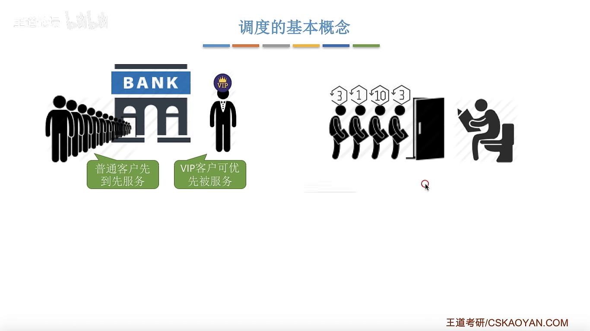
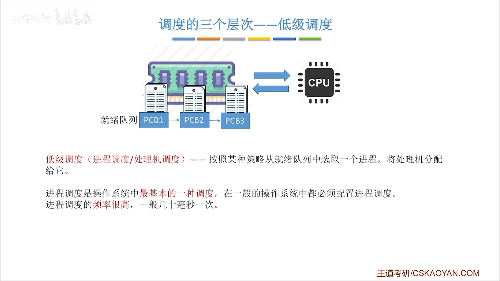
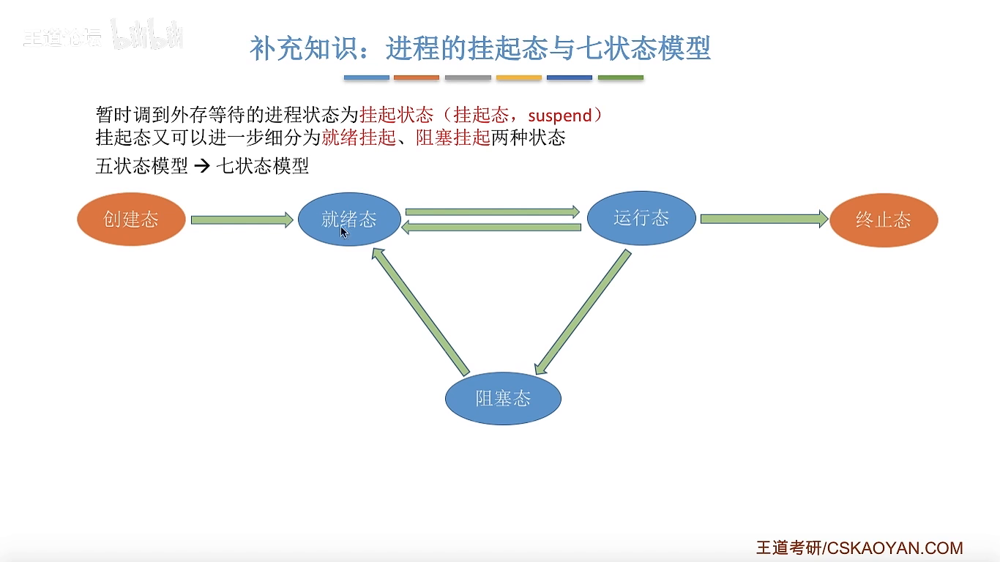
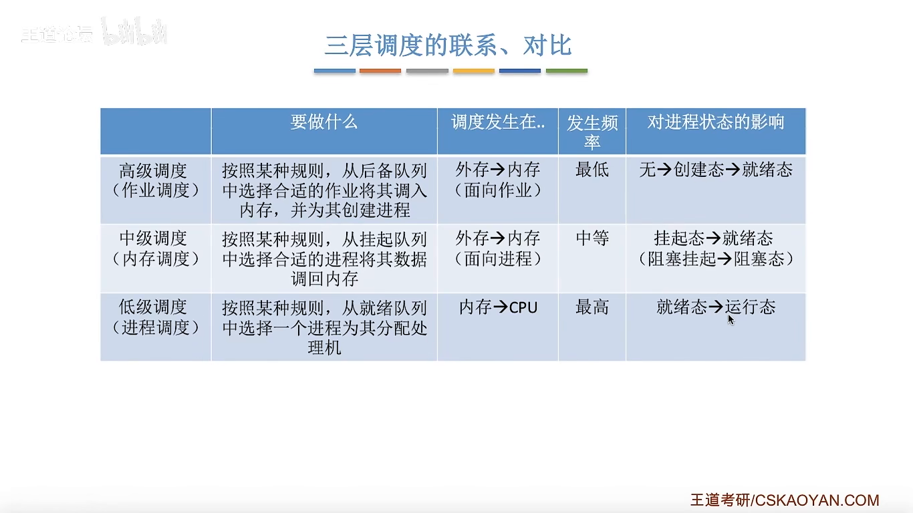

# 调度的概念、层次

> 📖 笔记整理自：【王道计算机考研 操作系统】2.2.1 调度的概念、层次
> 🔴 **重要度：核心考点**（调度三层次、挂起态、七状态模型均为高频考点）

---

## 本节主题

本节回答三个问题：什么是调度？调度有哪三个层次？三层调度如何联系和对比？并由中级调度引出**挂起态**和**七状态模型**这两个补充知识点。

---

## 一、什么是调度？

调度的本质：**当资源有限、任务众多时，按照某种规则决定处理顺序。**

> 🖼️ **图解说明**：用银行窗口和宿舍卫生间两个场景引出调度概念，直观展示"资源有限→制定规则→决定顺序"的过程。

> 🌰 **生动比喻——宿舍卫生间**：
> 宿舍只有一个卫生间，四个人需要使用的时间分别是 3分钟、10分钟、1分钟、3分钟。大家商量后采用"短作业优先"规则，顺序变为 1→3→4→2，总等待时间最短。这就是操作系统调度算法研究的核心问题。

---

## 二、三个调度层次

### 1. 高级调度（作业调度）

**发生在：外存 → 内存**

> 💡 **作业的概念**：用户向操作系统提交的一个具体任务（程序）。"提交作业"可理解为"让操作系统启动某个程序"。

当内存资源不足时，用户提交的作业无法立刻装入内存运行。操作系统从**作业后备队列**中按一定规则选择作业，调入内存，并为其**建立 PCB**（即创建进程）。

> 🖼️ **图解说明**：外存中有多个等待的作业，高级调度按规则选出一个调入内存，建立对应 PCB，使其进入就绪队列。

| 关键点 | 说明 |
|---|---|
| 调度对象 | **作业** |
| 发生位置 | 外存 ↔ 内存 |
| 每个作业调入/调出次数 | **各一次** |
| 调入时动作 | 建立 PCB（创建进程） |
| 调出时动作 | 撤销 PCB |

---

### 2. 低级调度（进程调度 / 处理机调度）

**发生在：内存 → CPU**

内存中同时存在多个就绪进程，CPU 资源有限，操作系统从**就绪队列**中按策略选一个进程，将处理机分配给它。

| 关键点 | 说明 |
|---|---|
| 调度对象 | **进程**（引入线程后为线程） |
| 发生位置 | 内存 ↔ CPU |
| 发生频率 | **最高**（需频繁切换才能让用户感知并发） |
| 是否必需 | **是**，多道程序并发执行的基础 |

> ⭐ 进程调度是操作系统中**最基本**的调度，频率最高。

---

### 3. 中级调度（内存调度）

**发生在：外存 ↔ 内存（针对进程）**

当内存不足时，将暂时不需要运行的进程的数据从内存移到外存，使该进程进入**挂起状态**；待内存空闲时，再将其调回内存。

> 🖼️ **图解说明**：内存中有多个进程，当内存紧张时，操作系统将低优先级进程的数据换出到外存（挂起），释放内存空间；之后内存空闲时再换回（激活）。

> 💡 **生活例子——手机切换 App 卡顿**：
> - 切换 App 很流畅 → 该 App 数据**还在内存**里
> - 切换 App 明显卡顿 → 该 App 数据**已被换出到外存**，系统正在进行中级调度，把数据重新读回内存，卡顿的过程就是这个读取过程

| 关键点 | 说明 |
|---|---|
| 调度对象 | **进程**（进程映像） |
| 发生位置 | 外存 ↔ 内存 |
| 发生频率 | 高于高级调度（一个进程可多次换入换出） |

---

## 三、挂起态与七状态模型

挂起状态细分为两种：

| 状态 | 含义 |
|---|---|
| **就绪挂起** | 进程就绪，但数据在外存 |
| **阻塞挂起** | 进程阻塞，且数据在外存 |

> 🖼️ **图解说明**：在五状态模型（创建、就绪、运行、阻塞、终止）基础上加入就绪挂起和阻塞挂起，形成七状态模型。箭头展示各状态间的转换路径。

### 七状态转换关系（新增部分）

| 转换 | 触发条件 |
|---|---|
| 就绪 → 就绪挂起 | 内存不足，将就绪进程换出外存 |
| 就绪挂起 → 就绪 | 内存空闲，将该进程换回内存（激活） |
| 阻塞 → 阻塞挂起 | 内存不足，将阻塞进程换出外存 |
| 阻塞挂起 → 就绪挂起 | 等待的事件发生，但仍在外存 |
| 阻塞挂起 → 阻塞 | 换回内存但事件尚未发生 |
| 运行 → 就绪挂起 | 进程下处理机后直接被换出 |
| 创建 → 就绪挂起 | 创建完 PCB 后内存不足，暂不入内存 |

> ⭐ **挂起态 vs 阻塞态的区别**：
> - **阻塞态**：暂时不能获得 CPU，但进程映像**还在内存**中
> - **挂起态**：暂时不能获得 CPU，进程映像**在外存**中

> ⭐ **考试提示**：五状态模型是 408 必考内容；七状态模型在自主命题学校中也可能出现，需要了解。

---

## 四、三层调度对比总结

> 🖼️ **图解说明**：三层调度从上到下依次为高级→中级→低级，对应外存→内存→CPU 的层次关系，频率从低到高。

| | 高级调度（作业调度） | 中级调度（内存调度） | 低级调度（进程调度） |
|---|---|---|---|
| **调度对象** | 作业 | 进程（映像） | 进程/线程 |
| **发生位置** | 外存 ↔ 内存 | 外存 ↔ 内存 | 内存 ↔ CPU |
| **频率** | 最低 | 中等 | **最高** |
| **对进程状态的影响** | 无→创建→就绪 | 挂起↔就绪/阻塞 | 就绪→运行 |
| **是否建立/撤销 PCB** | ✅ 是 | ❌ 否 | ❌ 否 |

---

## 考点速记

| 考点 | 要点 |
|---|---|
| 三层调度别名 | 高级=作业调度；中级=内存调度；低级=进程调度/处理机调度 |
| 频率顺序 | 低级 > 中级 > 高级 |
| 高级调度特点 | 每个作业只调入/调出各一次，调入时建 PCB |
| 中级调度特点 | 同一进程可多次换入换出，不建/撤销 PCB |
| 挂起 vs 阻塞 | 挂起：数据在外存；阻塞：数据在内存 |
| 七状态模型 | 五状态 + 就绪挂起 + 阻塞挂起 |

---

> **黄金总结**：三层调度对应资源分配的三个层次——高级调度决定哪些作业进内存，中级调度在内存紧张时将进程换入换出外存，低级调度决定哪个就绪进程获得 CPU；频率依次升高，共同保障多道程序的高效并发运行。
